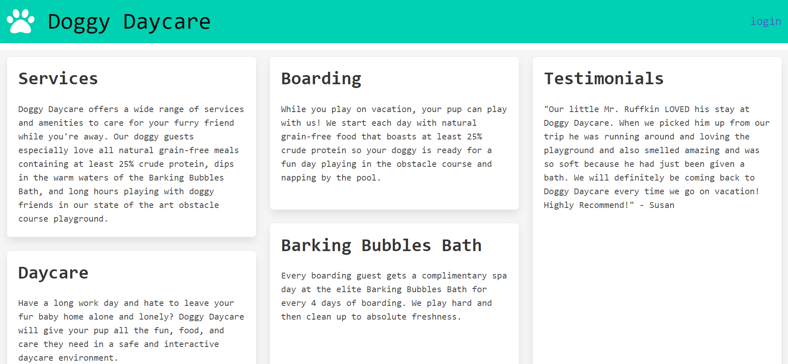
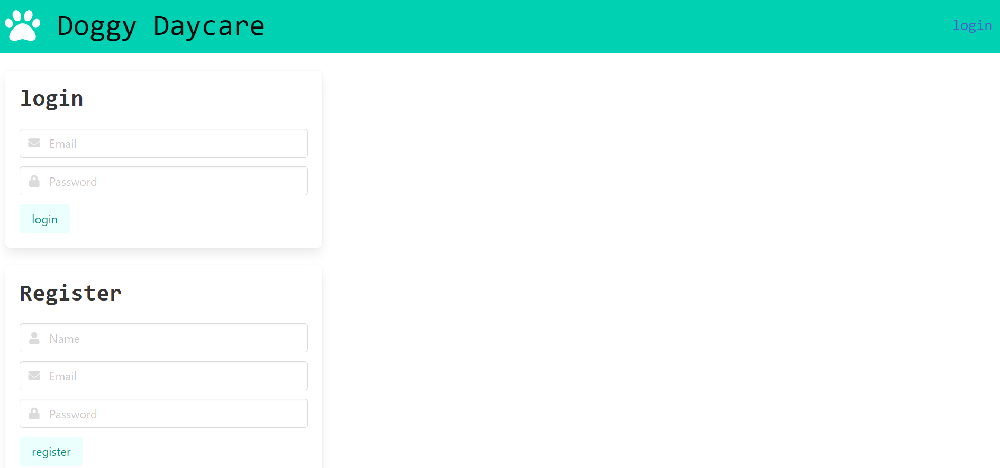

# dog-daycare

## Description

The Doggy Daycare website is made for new users and existing clients to book reservations for their Dogs.

## Table of Contents

- [Description](#description)
- [Installation](#installation)
- [Usage](#usage)
- [Credits](#credits)
- [Links](#links)

## Installation

The user needs to visit the following URl site and register to create an account.

## Usage

New users can register to create an account, once the account is created, the user can login to the website in the future. Login information will be saved. Once a user is logged in, they are able to create reservations, view past reservations and delete reservations.

## Credits

node js, mySql, mysql2, sequelize, express, dotenv, bcrypt, Bulma, and Fontawesome and Insomnia.

Collaborators: Yessenia Vieyra - https://github.com/Yvieyra Hannah Edwards - https://github.com/hannahedwards
Amanda Paul - https://github.com/amandapaul1223 Styrling John - https://github.com/Styrlingjohn

## Links & Screenshots

Heroku Deployed URL: https://gentle-fjord-00735.herokuapp.com/
Github URL: https://github.com/hannahedwards/dog-daycare.git

